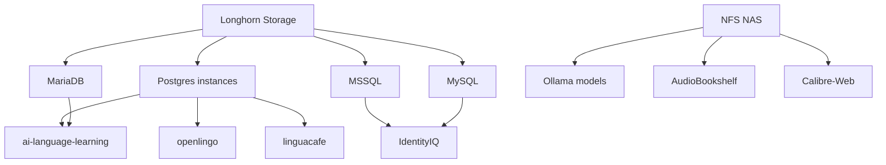

# K3S CLUSTER REMEDIATION PLAN
# Kubernetes Specialist Actionable Framework

**Cluster:** K3s Homelab (9 nodes: 1 control-plane, 8 workers)  
**Generated:** 2026-09-18  
**Owner:** suryendub  
**Priority:** CRITICAL - Cluster instability affecting production workloads

---

## 📊 EXECUTIVE SUMMARY

| Metric | Current State | Target State | Status |
|--------|---------------|--------------|--------|
| Nodes Ready | 8/9 (89%) | 9/9 (100%) | ❌ CRITICAL |
| Pod Health | 138 active, 1 Pending, 2 CrashLoopBackOff | 138 active, 0 failures | ❌ CRITICAL |
| Pod Restarts | 28,480+ total | <100 total | ❌ CRITICAL |
| Resource Limits | ~10% of pods | 100% of pods | ❌ CRITICAL |
| Health Checks | ~0% of containers | 100% of containers | ❌ CRITICAL |
| Service Accounts | 100% default | 0% default | ❌ CRITICAL |
| RBAC | Not implemented | Least privilege | ❌ CRITICAL |
| Network Policies | 1/15 namespaces | 15/15 namespaces | ❌ CRITICAL |
| Secrets | In git plaintext | Encrypted, not in git | ❌ CRITICAL |

**Overall Cluster Health Score: 5.8/10**  
**Security Compliance Score: 2/10**  
**Production Readiness: NOT READY**

---

## 🚨 CRITICAL ISSUES (P0 - DO TODAY)

### P0.1: Dead Node Recovery
**Issue:** Node `kubernetes8-debian` (192.168.0.27) is NotReady with 0 pods

**Impact:** 11% cluster capacity loss

**Diagnosis Commands:**
```bash
# Check node status
kubectl describe node kubernetes8-debian

# Check k3s agent status (if node is reachable)
ssh suryendub@192.168.0.27 "sudo systemctl status k3s-agent"

# Check node conditions
kubectl get node kubernetes8-debian -o json | jq '.status.conditions[] | select(.status=="False")'
```

**Remediation Steps:**
```bash
# 1. Verify node is powered on and network reachable
ping 192.168.0.27

# 2. If reachable, restart k3s-agent
ssh suryendub@192.168.0.27 "sudo systemctl restart k3s-agent"

# 3. Check for disk pressure
ssh suryendub@192.168.0.27 "df -h"

# 4. If unrecoverable, cordon and investigate
kubectl cordon kubernetes8-debian
```

**Verification:**
```bash
kubectl get nodes | grep kubernetes8-debian | grep -q Ready && echo "✅ RECOVERED" || echo "❌ STILL DOWN"
```

**Owner:** suryendub  
**ETR:** 1 hour  
**Status:** ⏳ NOT STARTED

---

### P0.2: CNPG Controller Manager Catastrophic Restarts
**Issue:** `cnpg-controller-manager` has **28,480 restarts** in 80 days (1 restart every 4 minutes)

**Impact:** PostgreSQL operator is non-functional, affecting database management

**Diagnosis Commands:**
```bash
# Get pod details
kubectl get pods -n cnpg-system -l app.kubernetes.io/name=cloudnative-pg

# Get logs from current instance
kubectl logs -n cnpg-system deploy/cnpg-controller-manager --tail=100

# Get previous instance logs (for crash reason)
kubectl logs -n cnpg-system deploy/cnpg-controller-manager --previous --tail=100

# Check events
kubectl get events -n cnpg-system --sort-by='.metadata.creationTimestamp' | tail -20

# Check resource limits
kubectl get deploy -n cnpg-system cnpg-controller-manager -o yaml | grep -A5 resources
```

**Root Cause:** Missing resource limits causing OOM kills

**Remediation Steps:**
```bash
# 1. Patch with resource limits
kubectl patch deploy -n cnpg-system cnpg-controller-manager --type='json' -p='[
  {"op": "add", "path": "/spec/template/spec/containers/0/resources", "value": {
    "limits": {"cpu": "1", "memory": "1Gi"},
    "requests": {"cpu": "500m", "memory": "512Mi"}
  }}
]'

# 2. Add liveness probe
kubectl patch deploy -n cnpg-system cnpg-controller-manager --type='json' -p='[
  {"op": "add", "path": "/spec/template/spec/containers/0/livenessProbe", "value": {
    "httpGet": {"path": "/healthz", "port": 9443},
    "initialDelaySeconds": 30,
    "periodSeconds": 10,
    "timeoutSeconds": 5,
    "failureThreshold": 3
  }}
]'

# 3. Verify CNPG version and known issues
kubectl get deploy -n cnpg-system cnpg-controller-manager -o yaml | grep image
```

**Verification:**
```bash
# Check restart count after fix
kubectl get pods -n cnpg-system -l app.kubernetes.io/name=cloudnative-pg -o json | jq '.items[0].status.containerStatuses[0].restartCount'
```

**Owner:** suryendub  
**ETR:** 2 hours  
**Status:** ⏳ NOT STARTED

---

### P0.3: Registry Fixer DaemonSet Cancer
**Issue:** 7+ `registry-fixer` DaemonSet pods with 115-2,913 restarts each

**Impact:** Wasteful resource consumption, masking real registry issues

**Diagnosis Commands:**
```bash
# List all registry-fixer pods
kubectl get pods -n kube-system -l app=registry-fixer -o wide

# Check logs
kubectl logs -n kube-system $(kubectl get pods -n kube-system -l app=registry-fixer -o name | head -1) --tail=50

# Check what they're trying to fix
kubectl get cm -n kube-system registries.conf -o yaml 2>/dev/null || echo "No ConfigMap found"

# Check actual registry config on a node
kubectl get node kubernetes1 -o json | jq -r '.metadata.annotations["k8s.io/registry-config"]' 2>/dev/null || ssh suryendub@192.168.0.19 "cat /etc/containers/registries.conf"
```

**Root Cause:** Likely fixing a symlink or config issue that keeps recurring

**Remediation Steps:**
```bash
# 1. DELETE ALL registry-fixer DaemonSets
kubectl delete daemonset -n kube-system registry-fixer --all

# 2. Identify the actual problem
# Check if /etc/containers/registries.conf exists and is correct
ssh suryendub@192.168.0.19 "ls -la /etc/containers/registries.conf"

# 3. Create a proper, persistent fix
# Example: Create a ConfigMap with correct registries.conf
kubectl create cm -n kube-system registries.conf --from-file=/path/to/correct/registries.conf --dry-run=client -o yaml | kubectl apply -f -

# 4. Mount it properly to all nodes (if needed)
```

**Verification:**
```bash
kubectl get pods -n kube-system -l app=registry-fixer | grep -q Running && echo "❌ STILL EXISTS" || echo "✅ REMOVED"
```

**Owner:** suryendub  
**ETR:** 1 hour  
**Status:** ⏳ NOT STARTED

---

### P0.4: Secrets in Git - Security Catastrophe
**Issue:** Plaintext credentials checked into git repository

**Impact:** Git history contains secrets forever, no rotation capability

**Diagnosis Commands:**
```bash
# Find all secret files in git
find kubernetes-manifests -name "*secret*.yaml" -o -name "*credentials*.yaml" -o -name "*password*.yaml" | grep -v node_modules

# Check git history for secrets
git log --all --oneline -- kubernetes-manifests | head -20
```

**Remediation Steps:**
```bash
# 1. Remove secrets from git (but keep locally)
git rm --cached kubernetes-manifests/**/*secret*.yaml
Git rm --cached kubernetes-manifests/**/*credentials*.yaml

# 2. Install Sealed Secrets controller
kubectl apply -f https://github.com/bitnami-labs/sealed-secrets/releases/download/v0.22.0/controller.yaml

# 3. Encrypt existing secrets
# Install kubeseal
# brew install kubeseal (mac) or download binary

# For each secret file:
kubeseal --format yaml --cert sealed-secrets-cert.pem < secret.yaml > sealed-secret.yaml

# 4. Update manifests to use sealed secrets
# Change references from secret.yaml to sealed-secret.yaml

# 5. Add sealed-secrets to .gitignore
echo "kubernetes-manifests/**/*secret*.yaml" >> .gitignore
echo "kubernetes-manifests/**/*credentials*.yaml" >> .gitignore
```

**Verification:**
```bash
# Check no secrets in git
git status | grep -q "deleted:" && echo "⚠️ Check deleted files" || echo "✅ No secrets in staging"
git ls-files | xargs grep -l "password\|secret\|token\|key" 2>/dev/null | grep -v ".gitignore" | wc -l
```

**Owner:** suryendub  
**ETR:** 4 hours  
**Status:** ⏳ NOT STARTED

---

### P0.5: No Service Accounts - Security Hole
**Issue:** All application pods using default ServiceAccount

**Impact:** No least privilege, no audit trail, potential privilege escalation

**Diagnosis Commands:**
```bash
# Find pods using default SA
kubectl get pods --all-namespaces -o custom-columns=NS:.metadata.namespace,POD:.metadata.name,SA:.spec.serviceAccountName | grep default

# Count by namespace
kubectl get pods --all-namespaces -o json | jq -r '.items[] | select(.spec.serviceAccountName == "default") | .metadata.namespace' | sort | uniq -c | sort -nr
```

**Remediation Steps:**
```bash
# For each namespace with apps, create:
# 1. ServiceAccount
# 2. Role with minimal permissions
# 3. RoleBinding

# Example for media namespace:
cat <<EOF | kubectl apply -f -
apiVersion: v1
kind: ServiceAccount
metadata:
  name: media-sa
  namespace: media
---
apiVersion: rbac.authorization.k8s.io/v1
kind: Role
metadata:
  name: media-role
  namespace: media
rules:
- apiGroups: [""]
  resources: ["pods", "services", "configmaps"]
  verbs: ["get", "list", "watch"]
- apiGroups: [""]
  resources: ["persistentvolumeclaims"]
  verbs: ["get", "list"]
---
apiVersion: rbac.authorization.k8s.io/v1
kind: RoleBinding
metadata:
  name: media-rolebinding
  namespace: media
subjects:
- kind: ServiceAccount
  name: media-sa
  namespace: media
roleRef:
  kind: Role
  name: media-role
  apiGroup: rbac.authorization.k8s.io
EOF

# Then update deployments to use the SA:
kubectl patch deploy -n media audiobookshelf --type='json' -p='[{"op": "replace", "path": "/spec/template/spec/serviceAccountName", "value": "media-sa"}]'
```

**Verification:**
```bash
kubectl get pods --all-namespaces -o custom-columns=NS:.metadata.namespace,POD:.metadata.name,SA:.spec.serviceAccountName | grep -v default | wc -l
```

**Owner:** suryendub  
**ETR:** 8 hours  
**Status:** ⏳ NOT STARTED

---

### P0.6: No Network Policies - Network Security Void
**Issue:** Only `iiqstack` namespace has NetworkPolicies. 14 other namespaces have none.

**Impact:** Lateral movement possible, no network segmentation, databases exposed

**Diagnosis Commands:**
```bash
# List namespaces without NetworkPolicies
kubectl get ns -o name | while read ns; do count=$(kubectl get networkpolicy -n ${ns#*/} 2>/dev/null | wc -l); if [ "$count" -eq "0" ]; then echo "$ns: NO NetworkPolicies"; fi; done
```

**Remediation Steps:**
```bash
# Apply default-deny-all to EVERY namespace
NAMESPACES=$(kubectl get ns -o jsonpath='{.items[*].metadata.name}')

for ns in $NAMESPACES; do
  # Check if default-deny-all already exists
  if ! kubectl get networkpolicy -n $ns default-deny-all 2>/dev/null; then
    cat <<EOF | kubectl apply -f -
apiVersion: networking.k8s.io/v1
kind: NetworkPolicy
metadata:
  name: default-deny-all
  namespace: $ns
spec:
  podSelector: {}
  policyTypes: ["Ingress", "Egress"]
EOF
  fi
done

# Then allow specific traffic (example for media namespace)
cat <<EOF | kubectl apply -f -
apiVersion: networking.k8s.io/v1
kind: NetworkPolicy
metadata:
  name: allow-dns
  namespace: media
spec:
  podSelector: {}
  policyTypes: ["Egress"]
  egress:
  - to:
    - namespaceSelector:
        matchLabels:
          kubernetes.io/metadata.name: kube-system
    ports:
    - protocol: UDP
      port: 53
    - protocol: TCP
      port: 53
EOF
```

**Verification:**
```bash
kubectl get ns -o name | while read ns; do count=$(kubectl get networkpolicy -n ${ns#*/} 2>/dev/null | wc -l); echo "$ns: $count NetworkPolicies"; done
```

**Owner:** suryendub  
**ETR:** 2 hours  
**Status:** ⏳ NOT STARTED

---

## 🔧 HIGH PRIORITY (P1 - DO THIS WEEK)

### P1.1: Add Resource Limits to ALL Containers
**Issue:** Only ~10% of pods have resource limits

**Impact:** Resource starvation, OOM kills, CPU throttling, unpredictable scheduling

**Diagnosis Commands:**
```bash
# Find pods WITHOUT resource limits
kubectl get pods --all-namespaces -o json | \
  jq -r '.items[] | select(.spec.containers[0].resources.limits | not) | "[" + .metadata.namespace + "] " + .metadata.name' | \
  sort | uniq

# Count by namespace
kubectl get pods --all-namespaces -o json | \
  jq -r '.items[] | select(.spec.containers[0].resources.limits | not) | .metadata.namespace' | \
  sort | uniq -c | sort -nr
```

**Remediation Steps:**
```bash
# Template for adding limits to a deployment
# Save as add-limits.sh
#!/bin/bash
NAMESPACE=$1
DEPLOYMENT=$2
CPU_REQUEST=$3
CPU_LIMIT=$4
MEM_REQUEST=$5
MEM_LIMIT=$6

kubectl patch deploy -n $NAMESPACE $DEPLOYMENT --type='json' -p="[
  {\"op\": \"add\", \"path\": \"/spec/template/spec/containers/0/resources\", \"value\": {
    \"limits\": {\"cpu\": \"$CPU_LIMIT\", \"memory\": \"$MEM_LIMIT\"},
    \"requests\": {\"cpu\": \"$CPU_REQUEST\", \"memory\": \"$MEM_REQUEST\"}
  }}
]"

# Example usage:
./add-limits.sh media audiobookshelf 100m 500m 256Mi 1Gi
```

**Bulk Fix Script:**
```bash
# add-resource-limits-all.sh
#!/bin/bash

# Define defaults for each namespace
declare -A CPU_REQUESTS
CPU_REQUESTS=(
  [ai]="500m"
  ["ai-language-learning"]="200m"
  [media]="100m"
  [monitoring]="50m"
  [dashboard]="50m"
  [server-management]="50m"
  [homepage]="50m"
  [iiqstack]="500m"
  [longhorn-system]="200m"
  [kube-system]="100m"
  [tailscale]="100m"
  [cnpg-system]="100m"
  [argocd]="100m"
)

declare -A CPU_LIMITS
CPU_LIMITS=(
  [ai]="2"
  ["ai-language-learning"]="1"
  [media]="1"
  [monitoring]="500m"
  [dashboard]="500m"
  [server-management]="500m"
  [homepage]="500m"
  [iiqstack]="4"
  [longhorn-system]="1"
  [kube-system]="500m"
  [tailscale]="500m"
  [cnpg-system]="1"
  [argocd]="500m"
)

declare -A MEM_REQUESTS
MEM_REQUESTS=(
  [ai]="1Gi"
  ["ai-language-learning"]="512Mi"
  [media]="256Mi"
  [monitoring]="128Mi"
  [dashboard]="128Mi"
  [server-management]="128Mi"
  [homepage]="128Mi"
  [iiqstack]="2Gi"
  [longhorn-system]="512Mi"
  [kube-system]="256Mi"
  [tailscale]="256Mi"
  [cnpg-system]="256Mi"
  [argocd]="256Mi"
)

declare -A MEM_LIMITS
MEM_LIMITS=(
  [ai]="4Gi"
  ["ai-language-learning"]="2Gi"
  [media]="2Gi"
  [monitoring]="1Gi"
  [dashboard]="1Gi"
  [server-management]="1Gi"
  [homepage]="1Gi"
  [iiqstack]="8Gi"
  [longhorn-system]="2Gi"
  [kube-system]="1Gi"
  [tailscale]="1Gi"
  [cnpg-system]="1Gi"
  [argocd]="1Gi"
)

# Get all deployments without limits
kubectl get deploy --all-namespaces -o json | \
  jq -r '.items[] | select(.spec.template.spec.containers[0].resources.limits | not) | "\(.metadata.namespace) \(.metadata.name)"' | \
  while read ns deployment; do
    cpu_req=${CPU_REQUESTS[$ns]:-100m}
    cpu_lim=${CPU_LIMITS[$ns]:-500m}
    mem_req=${MEM_REQUESTS[$ns]:-128Mi}
    mem_lim=${MEM_LIMITS[$ns]:-512Mi}
    
    echo "Adding limits to $ns/$deployment: CPU $cpu_req->$cpu_lim, MEM $mem_req->$mem_lim"
    kubectl patch deploy -n $ns $deployment --type='json' -p="[
      {\"op\": \"add\", \"path\": \"/spec/template/spec/containers/0/resources\", \"value\": {
        \"limits\": {\"cpu\": \"$cpu_lim\", \"memory\": \"$mem_lim\"},
        \"requests\": {\"cpu\": \"$cpu_req\", \"memory\": \"$mem_req\"}
      }}
    ]"
  done
```

**Verification:**
```bash
kubectl get pods --all-namespaces -o json | \
  jq -r '.items[] | select(.spec.containers[0].resources.limits | not) | "[" + .metadata.namespace + "] " + .metadata.name' | \
  wc -l
```

**Owner:** suryendub  
**ETR:** 4 hours  
**Status:** ⏳ NOT STARTED

---

### P1.2: Add Health Checks to ALL Containers
**Issue:** ~0% of containers have liveness/readiness probes

**Impact:** No self-healing, no graceful degradation, undetected failures

**Diagnosis Commands:**
```bash
# Find pods without probes
kubectl get pods --all-namespaces -o json | \
  jq -r '.items[] | select(.spec.containers[0].livenessProbe | not and .spec.containers[0].readinessProbe | not) | "[" + .metadata.namespace + "] " + .metadata.name' | \
  sort | uniq | head -20
```

**Remediation Steps:**
```bash
# Template for adding probes to a deployment
# add-probes.sh
#!/bin/bash
NAMESPACE=$1
DEPLOYMENT=$2
PORT=$3
LIVENESS_PATH=$4
READINESS_PATH=$5

kubectl patch deploy -n $NAMESPACE $DEPLOYMENT --type='json' -p="[
  {\"op\": \"add\", \"path\": \"/spec/template/spec/containers/0/livenessProbe\", \"value\": {
    \"httpGet\": {\"path\": \"$LIVENESS_PATH\", \"port\": $PORT},
    \"initialDelaySeconds\": 30,
    \"periodSeconds\": 10,
    \"timeoutSeconds\": 5,
    \"failureThreshold\": 3
  }},
  {\"op\": \"add\", \"path\": \"/spec/template/spec/containers/0/readinessProbe\", \"value\": {
    \"httpGet\": {\"path\": \"$READINESS_PATH\", \"port\": $PORT},
    \"initialDelaySeconds\": 5,
    \"periodSeconds\": 5,
    \"timeoutSeconds\": 2,
    \"failureThreshold\": 1
  }}
]"

# Example usage for web apps:
./add-probes.sh media audiobookshelf 8080 /healthz /ready
```

**Bulk Fix Approach:**
```bash
# For each app, determine appropriate probe type:
# - HTTP: httpGet probe (for web apps)
# - TCP: tcpSocket probe (for databases, non-HTTP)
# - Command: exec probe (for custom checks)

# Example: Add to all media namespace deployments
for deploy in $(kubectl get deploy -n media -o name | sed 's/deployments\///'); do
  # Check if app is web-based
  port=$(kubectl get deploy -n media $deploy -o json | jq -r '.spec.template.spec.containers[0].ports[0].containerPort // "8080"')
  kubectl patch deploy -n media $deploy --type='json' -p="[
    {\"op\": \"add\", \"path\": \"/spec/template/spec/containers/0/livenessProbe\", \"value\": {
      \"httpGet\": {\"path\": \"/healthz\", \"port\": $port},
      \"initialDelaySeconds\": 30,
      \"periodSeconds\": 10,
      \"timeoutSeconds\": 5,
      \"failureThreshold\": 3
    }},
    {\"op\": \"add\", \"path\": \"/spec/template/spec/containers/0/readinessProbe\", \"value\": {
      \"httpGet\": {\"path\": \"/ready\", \"port\": $port},
      \"initialDelaySeconds\": 5,
      \"periodSeconds\": 5,
      \"timeoutSeconds\": 2,
      \"failureThreshold\": 1
    }}
  ]" 
done
```

**Verification:**
```bash
kubectl get pods --all-namespaces -o json | \
  jq -r '.items[] | select(.spec.containers[0].livenessProbe | not) | "[" + .metadata.namespace + "] " + .metadata.name' | \
  wc -l
```

**Owner:** suryendub  
**ETR:** 4 hours  
**Status:** ⏳ NOT STARTED

---

### P1.3: Pin ALL Image Versions
**Issue:** Likely using `:latest` tags for production images

**Impact:** Unpredictable rollouts, no rollback capability, breaking changes auto-deployed

**Diagnosis Commands:**
```bash
# Find all containers using latest tag
kubectl get pods --all-namespaces -o json | \
  jq -r '.items[] | .spec.containers[] | select(.image | test(":latest$")) | "[" + (.metadata.namespace // "unknown") + "] " + .image' | \
  sort | uniq

# Find in manifests
grep -r "image:.*:latest" kubernetes-manifests/ | grep -v node_modules | grep -v ".git"
```

**Remediation Steps:**
```bash
# For each image:latest, find the current running version
kubectl get pods --all-namespaces -o json | \
  jq -r '.items[] | .spec.containers[] | select(.image | test(":latest$")) | .image' | \
  sort | uniq | \
  while read image; do
    namespace=$(kubectl get pods --all-namespaces -o json | \
      jq -r ".items[] | .spec.containers[] | select(.image == \"$image\") | .metadata.namespace" | head -1)
    pod=$(kubectl get pods --all-namespaces -o json | \
      jq -r ".items[] | .spec.containers[] | select(.image == \"$image\") | .metadata.name" | head -1)
    actual_image=$(kubectl get pod -n $namespace $pod -o json | \
      jq -r '.spec.containers[0].image')
    echo "Replace $image with $actual_image in manifests"
  done

# Then update manifests and re-apply
```

**Verification:**
```bash
grep -r "image:.*:latest" kubernetes-manifests/ | grep -v node_modules | grep -v ".git" | wc -l
```

**Owner:** suryendub  
**ETR:** 2 hours  
**Status:** ⏳ NOT STARTED

---

### P1.4: Implement ResourceQuotas in ALL Namespaces
**Issue:** Only `iiqstack` namespace has ResourceQuota

**Impact:** No resource governance, pods can consume unlimited resources, noisy neighbor problem

**Diagnosis Commands:**
```bash
# Find namespaces without ResourceQuota
kubectl get ns -o name | while read ns; do kubectl get resourcequota -n ${ns#*/} 2>/dev/null | wc -l; done | grep -B1 "^0$" | grep -v "^0$" | grep -v "--$"
```

**Remediation Steps:**
```bash
# Template for ResourceQuota
cat <<'EOF' > templates/resourcequota.yaml
apiVersion: v1
kind: ResourceQuota
metadata:
  name: {{namespace}}-quota
  namespace: {{namespace}}
spec:
  hard:
    requests.cpu: "10"
    requests.memory: "32Gi"
    limits.cpu: "20"
    limits.memory: "64Gi"
    pods: "50"
    persistentvolumeclaims: "20"
    services: "20"
    secrets: "50"
    configmaps: "50"
EOF

# Apply to all namespaces without quota
for ns in $(kubectl get ns -o jsonpath='{.items[*].metadata.name}'); do
  if ! kubectl get resourcequota -n $ns 2>/dev/null; then
    sed "s/{{namespace}}/$ns/g" templates/resourcequota.yaml | kubectl apply -f -
  fi
done
```

**Customize by Namespace:**
```yaml
# For ai namespace (LLM workloads need more resources)
apiVersion: v1
kind: ResourceQuota
metadata:
  name: ai-quota
  namespace: ai
spec:
  hard:
    requests.cpu: "20"
    requests.memory: "64Gi"
    limits.cpu: "40"
    limits.memory: "128Gi"
    pods: "20"
    persistentvolumeclaims: "10"
    requests.nvidia.com/gpu: "4"

# For iiqstack (already has one, but may need adjustment)
# Current: requests.cpu: "10", requests.memory: "20Gi"
# This seems reasonable for the IdentityIQ stack
```

**Verification:**
```bash
kubectl get ns -o name | while read ns; do echo -n "$ns: "; kubectl get resourcequota -n ${ns#*/} 2>/dev/null | wc -l; done
```

**Owner:** suryendub  
**ETR:** 2 hours  
**Status:** ⏳ NOT STARTED

---

### P1.5: Implement LimitRanges in ALL Namespaces
**Issue:** Only `iiqstack` namespace has LimitRange

**Impact:** No default resource requests/limits, inconsistent pod specifications

**Diagnosis Commands:**
```bash
# Find namespaces without LimitRange
kubectl get ns -o name | while read ns; do kubectl get limitrange -n ${ns#*/} 2>/dev/null | wc -l; done | grep -B1 "^0$" | grep -v "^0$" | grep -v "--$"
```

**Remediation Steps:**
```bash
# Template for LimitRange
cat <<'EOF' > templates/limitrange.yaml
apiVersion: v1
kind: LimitRange
metadata:
  name: {{namespace}}-limits
  namespace: {{namespace}}
spec:
  limits:
  - default:
      cpu: "1"
      memory: "2Gi"
    defaultRequest:
      cpu: "100m"
      memory: "256Mi"
    max:
      cpu: "4"
      memory: "8Gi"
    min:
      cpu: "10m"
      memory: "32Mi"
    type: Container
EOF

# Apply to all namespaces without LimitRange
for ns in $(kubectl get ns -o jsonpath='{.items[*].metadata.name}'); do
  if ! kubectl get limitrange -n $ns 2>/dev/null; then
    sed "s/{{namespace}}/$ns/g" templates/limitrange.yaml | kubectl apply -f -
  fi
done
```

**Customize by Namespace:**
```yaml
# For monitoring namespace (lightweight tools)
apiVersion: v1
kind: LimitRange
metadata:
  name: monitoring-limits
  namespace: monitoring
spec:
  limits:
  - default:
      cpu: "500m"
      memory: "512Mi"
    defaultRequest:
      cpu: "50m"
      memory: "64Mi"
    max:
      cpu: "2"
      memory: "4Gi"
    min:
      cpu: "10m"
      memory: "32Mi"
    type: Container

# For media namespace
apiVersion: v1
kind: LimitRange
metadata:
  name: media-limits
  namespace: media
spec:
  limits:
  - default:
      cpu: "500m"
      memory: "1Gi"
    defaultRequest:
      cpu: "100m"
      memory: "256Mi"
    max:
      cpu: "2"
      memory: "4Gi"
    min:
      cpu: "10m"
      memory: "32Mi"
    type: Container
```

**Verification:**
```bash
kubectl get ns -o name | while read ns; do echo -n "$ns: "; kubectl get limitrange -n ${ns#*/} 2>/dev/null | wc -l; done
```

**Owner:** suryendub  
**ETR:** 2 hours  
**Status:** ⏳ NOT STARTED

---

### P1.6: Fix Workload Imbalance
**Issue:** 4 nodes have 5 pods, 1 node has 1 pod, 1 node has 0 pods, 1 node dead

**Impact:** Uneven resource utilization, potential hotspots, poor scheduling

**Diagnosis Commands:**
```bash
# Current pod distribution
kubectl get pods -o wide --all-namespaces | awk '{print $8}' | sort | uniq -c | sort -nr

# Check for node selectors
kubectl get pods --all-namespaces -o json | \
  jq -r '.items[] | select(.spec.nodeSelector | length > 0) | "[" + .metadata.namespace + "] " + .metadata.name + " -> " + (.spec.nodeSelector | tostring)'

# Check for pod affinity
kubectl get pods --all-namespaces -o json | \
  jq -r '.items[] | select(.spec.affinity | length > 0) | "[" + .metadata.namespace + "] " + .metadata.name'
```

**Remediation Steps:**
```bash
# 1. Remove hard node selectors
# For each deployment with nodeSelector:
kubectl get deploy --all-namespaces -o json | \
  jq -r '.items[] | select(.spec.template.spec.nodeSelector | length > 0) | "kubectl patch deploy -n " + .metadata.namespace + " " + .metadata.name + " --type=json -p=\"[{\\\"op\\\": \\\"remove\\\", \\\"path\\\": \\\"/spec/template/spec/nodeSelector\\\"}]\""' | \
  bash

# 2. Add pod anti-affinity for StatefulSets
# For each StatefulSet:
for ns in $(kubectl get ns -o name | sed 's|namespace/||'); do
  for sts in $(kubectl get sts -n $ns -o name 2>/dev/null | sed 's|statefulset.app.k8s.io/||'); do
    cat <<EOF | kubectl apply -f -
apiVersion: apps/v1
kind: StatefulSet
metadata:
  name: $sts
  namespace: $ns
spec:
  template:
    spec:
      affinity:
        podAntiAffinity:
          preferredDuringSchedulingIgnoredDuringExecution:
          - weight: 100
            podAffinityTerm:
              labelSelector:
                matchExpressions:
                - key: app
                  operator: In
                  values:
                  - $sts
              topologyKey: kubernetes.io/hostname
EOF
  done
done

# 3. For Deployments, add anti-affinity
for ns in $(kubectl get ns -o name | sed 's|namespace/||'); do
  for deploy in $(kubectl get deploy -n $ns -o name 2>/dev/null | sed 's|deployments/||'); do
    app=$(kubectl get deploy -n $ns $deploy -o json | jq -r '.spec.template.metadata.labels.app // "unknown"')
    if [ "$app" != "unknown" ] && [ "$app" != "null" ]; then
      kubectl patch deploy -n $ns $deploy --type='json' -p="[
        {\"op\": \"add\", \"path\": \"/spec/template/spec/affinity\", \"value\": {
          \"podAntiAffinity\": {
            \"preferredDuringSchedulingIgnoredDuringExecution\": [
              {
                \"weight\": 100,
                \"podAffinityTerm\": {
                  \"labelSelector\": {
                    \"matchExpressions\": [
                      {\"key\": \"app\", \"operator\": \"In\", \"values\": [\"$app\"]}
                    ]
                  },
                  \"topologyKey\": \"kubernetes.io/hostname\"
                }
              }
            ]
          }
        }}
      ]"
    fi
  done
done
```

**Rebalance Cluster:**
```bash
# Cordon overloaded nodes
kubectl cordon kubernetes1 kubernetes2 kubernetes4 kubernetes7

# Drain them (respects PDBs)
for node in kubernetes1 kubernetes2 kubernetes4 kubernetes7; do
  kubectl drain $node --ignore-daemonsets --delete-emptydir-data
  sleep 30  # Wait for pods to reschedule
  kubectl uncordon $node
done
```

**Verification:**
```bash
kubectl get pods -o wide --all-namespaces | awk '{print $8}' | sort | uniq -c | sort -nr
```

**Owner:** suryendub  
**ETR:** 3 hours  
**Status:** ⏳ NOT STARTED

---

## 📈 MEDIUM PRIORITY (P2 - DO THIS MONTH)

### P2.1: Investigate Longhorn Stability
**Issue:** Longhorn components have high restart counts, storage requires manual recovery after power cycles

**Diagnosis Commands:**
```bash
# Check Longhorn health
kubectl get pods -n longhorn-system
kubectl get events -n longhorn-system --sort-by='.metadata.creationTimestamp' | tail -30

# Check Longhorn nodes
kubectl get nodes -n longhorn-system -o wide

# Check Longhorn volumes
kubectl get volumes -n longhorn-system

# Check for detached volumes
kubectl get volumes -n longhorn-system -o json | \
  jq -r '.items[] | select(.status.state != "attached") | .metadata.name'

# Check Longhorn settings
kubectl get settings -n longhorn-system
```

**Remediation Steps:**
```bash
# 1. Check Longhorn version
kubectl get deploy -n longhorn-system longhorn-manager -o yaml | grep image

# 2. Upgrade Longhorn if outdated
# Check latest version: https://longhorn.io/docs/

# 3. Add UPS to all nodes (prevent unclean shutdowns)
# This is a hardware solution, not Kubernetes

# 4. Configure Longhorn for better resilience
cat <<EOF | kubectl apply -f -
apiVersion: longhorn.io/v1beta2
kind: Setting
metadata:
  name: concurrent-automatic-engine-upgrade-per-node-limit
  namespace: longhorn-system
value: "1"
---
apiVersion: longhorn.io/v1beta2
kind: Setting
metadata:
  name: storage-over-provisioning-percentage
  namespace: longhorn-system
value: "500"  # 500% over-provisioning allowed
---
apiVersion: longhorn.io/v1beta2
kind: Setting
metadata:
  name: storage-minimal-available-percentage
  namespace: longhorn-system
value: "10"  # Minimum 10% free space
---
apiVersion: longhorn.io/v1beta2
kind: Setting
metadata:
  name: backup-target-sync-interval
  namespace: longhorn-system
value: "300"  # Sync every 5 minutes
EOF

# 5. Implement Longhorn backup to NAS
# You already have this configured in kubernetes-manifests/longhorn-backup/
# Verify it's working:
kubectl get recurringjobs -n longhorn-system
kubectl get backups -n longhorn-system | tail -10
```

**Verification:**
```bash
# After 1 week, check restart counts
kubectl get pods -n longhorn-system -o json | \
  jq -r '.items[] | .metadata.name + ": " + (.status.containerStatuses[0].restartCount // "0") + " restarts"'
```

**Owner:** suryendub  
**ETR:** 8 hours  
**Status:** ⏳ NOT STARTED

---

### P2.2: Fix Tailscale Operator Restarts
**Issue:** Tailscale operator pods have 750-1,585 restarts

**Diagnosis Commands:**
```bash
# Check operator logs
kubectl logs -n tailscale deploy/operator --tail=100

# Check for errors
kubectl logs -n tailscale deploy/operator --tail=100 | grep -i error

# Check Tailscale API connectivity
kubectl exec -n tailscale deploy/operator -- curl -v https://api.tailscale.com/api/v2/tailnet/your-tailnet/some-endpoint 2>&1 | head -20

# Check operator version
kubectl get deploy -n tailscale operator -o yaml | grep image
```

**Remediation Steps:**
```bash
# 1. Check Tailscale operator version compatibility
# Latest: https://github.com/tailscale/tailscale-operator/releases

# 2. Upgrade if outdated
# helm upgrade tailscale-operator tailscale/tailscale-operator --namespace tailscale

# 3. Check operator configuration
kubectl get cm -n tailscale tailscale-operator-config -o yaml

# 4. Check for rate limiting
kubectl get events -n tailscale | grep -i rate

# 5. Reinstall operator with proper config
helm repo add tailscale https://pkgs.tailscale.com/stable
helm repo update
helm upgrade --install tailscale-operator tailscale/tailscale-operator \
  --namespace tailscale \
  --set operator.image.tag=v1.58.0 \
  --set operator.createSecret=false
```

**Verification:**
```bash
# Check restart count after 24 hours
kubectl get pods -n tailscale -l app.kubernetes.io/name=tailscale-operator -o json | \
  jq -r '.items[0].status.containerStatuses[0].restartCount'
```

**Owner:** suryendub  
**ETR:** 4 hours  
**Status:** ⏳ NOT STARTED

---

### P2.3: Implement GitOps with ArgoCD
**Issue:** ArgoCD server has 525 restarts, not being used effectively

**Diagnosis Commands:**
```bash
# Check ArgoCD status
kubectl get pods -n argocd
kubectl logs -n argocd deploy/argocd-server --tail=50

# Check ArgoCD version
kubectl get deploy -n argocd argocd-server -o yaml | grep image

# Check applications
kubectl get app -n argocd
```

**Remediation Steps:**
```bash
# 1. Fix ArgoCD itself
# Check ArgoCD resource limits
kubectl get deploy -n argocd argocd-server -o yaml | grep -A5 resources

# Add limits
kubectl patch deploy -n argocd argocd-server --type='json' -p='[
  {"op": "add", "path": "/spec/template/spec/containers/0/resources", "value": {
    "limits": {"cpu": "1", "memory": "1Gi"},
    "requests": {"cpu": "500m", "memory": "512Mi"}
  }}
]'

# 2. Deploy ArgoCD Applications for all your manifests
# Create application for kubernetes-manifests
cat <<EOF | kubectl apply -f -
apiVersion: argoproj.io/v1alpha1
kind: Application
metadata:
  name: kubernetes-manifests
  namespace: argocd
spec:
  project: default
  source:
    repoURL: file:///Users/macbookpro/Documents/The-Kubernetes-Bible-Second-Edition/kubernetes-manifests
    targetRevision: main
    path: .
    directory:
      recurse: true
  destination:
    server: https://kubernetes.default.svc
    namespace: default
  syncPolicy:
    automated:
      prune: true
      selfHeal: true
    syncOptions:
    - CreateNamespace=true
    - ApplyOutOfSyncOnly=true
    retry:
      limit: 5
      backoff:
        duration: 5s
        factor: 2
        maxDuration: 3m
EOF

# 3. Add to .gitignore
cat <<EOF >> .gitignore
# ArgoCD
argocd/
 applications/
 appsets/
EOF
```

**Verification:**
```bash
# Check ArgoCD UI (access via Tailscale)
# Check sync status
kubectl get app -n argocd

# Check health
kubectl get app -n argocd kubernetes-manifests -o json | jq '.status.health'
```

**Owner:** suryendub  
**ETR:** 6 hours  
**Status:** ⏳ NOT STARTED

---

### P2.4: Consolidate Monitoring Stack
**Issue:** 14+ monitoring tools is overkill and resource-intensive

**Current Monitoring Tools:**
- Beszel (hub + agent)
- Uptime Kuma (+ monitors, sync)
- Kuvasz
- Lantern
- PooML
- OmniSight
- Dozzle
- Logchef
- Trove
- LAN Sheriff
- LanGuard
- Homelab Monitor
- Gotify
- Apprise

**Recommendation:**

| Keep | Remove | Reason |
|------|--------|--------|
| Prometheus + Grafana | Beszel, Kuvasz, Lantern, PooML, OmniSight | Standard metrics stack |
| Loki + Promtail | Logchef | Standard logging |
| Uptime Kuma | | Good for uptime monitoring |
| Dozzle | | Keep for container logs UI |
| Gotify + Apprise | | Keep for notifications |
| Trove | | Keep for Kubernetes catalog |

**Remediation Steps:**
```bash
# 1. Deploy Prometheus Operator
kubectl create ns monitoring
helm repo add prometheus-community https://prometheus-community.github.io/helm-charts
helm repo update
helm install prometheus prometheus-community/kube-prometheus-stack \
  --namespace monitoring \
  --set prometheus.prometheusSpec.retention=30d \
  --set prometheus.prometheusSpec.resources.requests.memory=4Gi \
  --set prometheus.prometheusSpec.resources.requests.cpu=1 \
  --set grafana.adminPassword=REPLACE_ME

# 2. Deploy Loki for logs
helm install loki grafana/loki \
  --namespace monitoring \
  --set loki.config.storage_config.aws_s3=false \
  --set loki.config.storage_config.filesystem.chunks_directory=/data/loki/chunks \
  --set loki.config.storage_config.filesystem.rules_directory=/data/loki/rules

helm install promtail grafana/promtail \
  --namespace monitoring \
  --set config.clients[0].url=http://loki:3100/loki/api/v1/push

# 3. Remove redundant tools (one at a time)
kubectl delete -f kubernetes-manifests/monitoring/beszel-agent.yaml
kubectl delete -f kubernetes-manifests/monitoring/beszel-hub.yaml
kubectl delete -f kubernetes-manifests/monitoring/kuvasz.yaml
kubectl delete -f kubernetes-manifests/monitoring/lantern.yaml
kubectl delete -f kubernetes-manifests/monitoring/pooml.yaml
kubectl delete -f kubernetes-manifests/monitoring/omnisight.yaml

# 4. Keep essential tools
# Dozzle, Uptime Kuma, Gotify, Apprise, Trove, LAN Sheriff, LanGuard, Homelab Monitor
```

**Verification:**
```bash
# Check monitoring namespace resource usage
kubectl top pods -n monitoring

# Check total monitoring pods
kubectl get pods -n monitoring | wc -l
```

**Owner:** suryendub  
**ETR:** 8 hours  
**Status:** ⏳ NOT STARTED

---

## 🎯 LOW PRIORITY (P3 - DO THIS QUARTER)

### P3.1: Implement Cluster-Wide Policies with Gatekeeper
**Purpose:** Enforce best practices at the admission control level

**Remediation Steps:**
```bash
# 1. Install Gatekeeper
kubectl create ns gatekeeper-system
helm repo add gatekeeper https://open-policy-agent.github.io/gatekeeper/charts
helm install gatekeeper gatekeeper/gatekeeper \
  --namespace gatekeeper-system \
  --set enableExternalData=true \
  --set replicas=1

# 2. Require resource limits
cat <<EOF | kubectl apply -f -
apiVersion: constraints.gatekeeper.sh/v1beta1
kind: K8sRequiredLabels
metadata:
  name: require-resource-limits
spec:
  match:
    kinds:
      - apiGroups: [""]
        kinds: ["Pod"]
    namespaces:
      - "ai"
      - "ai-language-learning"
      - "media"
      - "monitoring"
      - "dashboard"
      - "server-management"
      - "homepage"
  parameters:
    labels: ["app"]
EOF

# 3. Prevent latest tag
cat <<EOF | kubectl apply -f -
apiVersion: constraints.gatekeeper.sh/v1beta1
kind: K8sNoLatestTag
metadata:
  name: no-latest-tag
spec:
  match:
    kinds:
      - apiGroups: [""]
        kinds: ["Pod"]
EOF

# 4. Require liveness probes
cat <<EOF | kubectl apply -f -
apiVersion: constraints.gatekeeper.sh/v1beta1
kind: K8sRequireProbes
metadata:
  name: require-liveness-probe
spec:
  match:
    kinds:
      - apiGroups: ["apps"]
        kinds: ["Deployment", "StatefulSet", "DaemonSet"]
  parameters:
    probeType: "livenessProbe"
EOF
```

**Verification:**
```bash
# Check constraint violations
kubectl get constraint -n gatekeeper-system

# Check violations
kubectl get constrainttemplate -n gatekeeper-system
```

**Owner:** suryendub  
**ETR:** 4 hours  
**Status:** ⏳ NOT STARTED

---

### P3.2: Document All Services and Dependencies
**Purpose:** Create a service catalog for better maintainability

**Remediation Steps:**
```bash
# Create a services inventory
cat <<'EOF' > K3S_SERVICES_INVENTORY.md
# K3s Homelab Services Inventory

## Overview
Total: 138 pods across 15+ namespaces on 9 nodes

## By Namespace

### ai
- **Ollama**: LLM serving
- **Open WebUI**: Web interface for Ollama
- Dependencies: NFS storage for models
- Access: Tailscale

### ai-language-learning
- **Backend**: AI Language Tutor
- **Postgres**: Database
- Dependencies: 
- Access: Tailscale

### openlingo (media namespace)
- **Frontend**: Next.js application
- **Backend**: Language platform
- **Postgres**: Database
- Dependencies: 
- Access: Tailscale

### linguacafe
- **Webapp**: Reading application
- **MariaDB**: Database
- **Redis**: Cache
- Dependencies: 
- Access: Tailscale

### iiqstack
- **IdentityIQ**: SailPoint identity management
- **LDAP**: Directory service
- **ActiveMQ**: Message broker
- **MSSQL**: Database
- **MySQL**: Database
- **Mailpit**: Email testing
- Dependencies: Complex, interdependent
- Access: Tailscale
- Note: Has ResourceQuota and NetworkPolicies

### media
- **AudioBookshelf**: Audiobook management
- **Calibre-Web**: Ebook management
- **BookOrbit**: Book management
- **BookHoarder**: Book collection
- **Booklogr**: Reading tracker
- **LibrisLog**: Library logger
- **Immich**: Photo management (server, ML, Valkey, Postgres)
- **Flick**: File sharing (Go API, web, Caddy, Postgres)
- **pgweb**: PostgreSQL explorer
- Dependencies: NFS for large media
- Note: High resource consumption, needs attention

### homepage
- **gethomepage**: Dashboard
- Dependencies: None
- Access: Tailscale

### monitoring
- **Beszel**: Monitoring hub
- **Uptime Kuma**: Uptime monitoring
- **Kuvasz**: 
- **Lantern**: 
- **PooML**: 
- **OmniSight**: 
- **Dozzle**: Container logging UI
- **Logchef**: Log analytics
- **Trove**: Kubernetes catalog
- **LAN Sheriff**: Network monitoring
- **LanGuard**: Network monitoring
- **Homelab Monitor**: Dashboard
- **Gotify**: Push notifications
- **Apprise**: Notification gateway
- Note: 14 tools, needs consolidation

### dashboard
- **Homarr**: Dashboard
- **Cairn**: 
- Dependencies: None
- Access: Tailscale

### server-management
- **HomeLab Manager**: 
- **RemotePower**: 
- Dependencies: None
- Access: Tailscale

### longhorn-system
- **Longhorn Manager**: Storage management
- **Longhorn Driver Deployer**: Storage driver
- **Longhorn CSI Plugin**: Container Storage Interface
- Note: Needs stabilization

### kube-system
- **CoreDNS**: DNS
- **Traefik**: Ingress
- **Metrics Server**: Metrics
- **Local Path Provisioner**: Local storage
- **registry-fixer**: Multiple DaemonSets (REMOVE)
- Note: Core services, registry-fixer is problematic

### tailscale
- **Operator**: Tailscale operator
- **Proxy**: Tailscale proxy
- **Various service pods**: ts-*, argocd-server
- Note: Operator has high restart count

### cnpg-system
- **CNPG Controller Manager**: PostgreSQL operator
- Note: 28,480 restarts - CRITICAL

### argocd
- **Server**: GitOps server
- Note: 525 restarts, not being used

## By Node

### Control Plane
- **nuc** (192.168.0.21): Control plane, 0 application pods, 30% CPU, 30% memory

### Workers
- **kubernetes1** (192.168.0.19): 5 pods, 13% CPU, 20% memory
- **kubernetes2** (192.168.0.20): 5 pods, 3% CPU, 11% memory
- **kubernetes3** (192.168.0.22): 2 pods, 8% CPU, 10% memory
- **kubernetes4** (192.168.0.23): 5 pods, 4% CPU, 20% memory
- **kubernetes5** (192.168.0.24): 1 pod, 5% CPU, 26% memory
- **kubernetes6** (192.168.0.25): 2 pods, 44% CPU, 13% memory - HOTSPOT
- **kubernetes7** (192.168.0.26): 5 pods, 23% CPU, 46% memory - HOTSPOT
- **kubernetes8-debian** (192.168.0.27): 0 pods, NotReady - DEAD

## Dependencies Map



## Access Methods
- **Tailscale**: Primary access method for all web services
- **Internal**: Some services communicate internally via Kubernetes DNS
- **NodePort**: Some services may use NodePort for local access

## Data Flow
1. User -> Tailscale -> Traefik Ingress -> Service
2. Service -> Database (Postgres, MSSQL, MySQL, MariaDB)
3. Service -> Storage (Longhorn PVC or NFS)
4. Monitoring -> Prometheus/Grafana (future)
EOF

# Add to .gitignore
echo "K3S_SERVICES_INVENTORY.md" >> .gitignore
```

**Verification:**
```bash
# Check file exists
ls -la K3S_SERVICES_INVENTORY.md
```

**Owner:** suryendub  
**ETR:** 4 hours  
**Status:** ⏳ NOT STARTED

---

### P3.3: Implement Power Protection (UPS)
**Purpose:** Prevent unclean shutdowns that break Longhorn and CoreDNS

**Remediation Steps:**
```bash
# Hardware solution - not a Kubernetes command

# 1. Purchase UPS for each node
#    - CyberPower CP1500PFCLCD (1500VA) for control plane
#    - CyberPower CP1350AVR (1350VA) for workers
#    - Or equivalent APC models

# 2. Connect UPS to nodes via USB
#    - Each node gets its own UPS

# 3. Install and configure NUT (Network UPS Tools)
#    On Ubuntu/Debian:
#    sudo apt install nut nut-client nut-server

# 4. Configure NUT
#    /etc/nut/ups.conf:
#    [kubernetes1]
#        driver = usbhid-ups
#        port = auto

# 5. Configure shutdown scripts
#    /etc/nut/upsmon.conf:
#    MONITOR kubernetes1@localhost 1 upsmon secret master
#    SHUTDOWNCMD "/sbin/shutdown -h +0"

# 6. Test UPS failover
#    Unplug node from power, verify graceful shutdown

# 7. Configure K3s to handle graceful shutdown
#    Edit /etc/systemd/system/k3s-agent.service.d/override.conf:
#    [Service]
#    ExecStop=/usr/local/bin/k3s cordon $(hostname) && sleep 30 && /usr/local/bin/k3s drain $(hostname) --ignore-daemonsets --delete-emptydir-data --grace-period=30
```

**Verification:**
```bash
# Check UPS status on a node
ssh suryendub@192.168.0.19 "upsc kubernetes1"

# Test graceful shutdown (CAUTION)
# ssh suryendub@192.168.0.19 "sudo systemctl stop k3s-agent"
# Watch node status: kubectl get nodes -w
```

**Owner:** suryendub  
**ETR:** 16 hours (hardware procurement + setup)  
**Status:** ⏳ NOT STARTED

---

## 📅 ACTION PLAN TIMELINE

### Week 1: Critical Stability
- [ ] P0.1: Fix dead node (kubernetes8-debian)
- [ ] P0.2: Fix CNPG controller restarts
- [ ] P0.3: Remove registry-fixer DaemonSets
- [ ] P0.4: Remove secrets from git
- [ ] P0.5: Create ServiceAccounts for all apps
- [ ] P0.6: Add NetworkPolicies to all namespaces
- [ ] P1.1: Add resource limits to all containers
- [ ] P1.2: Add health checks to all containers

### Week 2: Resource Governance
- [ ] P1.3: Pin all image versions
- [ ] P1.4: Add ResourceQuotas to all namespaces
- [ ] P1.5: Add LimitRanges to all namespaces
- [ ] P1.6: Fix workload imbalance

### Week 3: Storage & Networking
- [ ] P2.1: Investigate and fix Longhorn stability
- [ ] P2.2: Fix Tailscale operator restarts
- [ ] P2.3: Implement GitOps with ArgoCD

### Week 4: Optimization
- [ ] P2.4: Consolidate monitoring stack
- [ ] P3.1: Implement Gatekeeper policies
- [ ] P3.2: Document services and dependencies

### Week 5: Hardware
- [ ] P3.3: Implement UPS protection

---

## 🎯 VERIFICATION CHECKLIST

Run this script to check progress:

```bash
#!/bin/bash

echo "==================================="
echo "K3S CLUSTER REMEDIATION VERIFICATION"
echo "==================================="
echo ""

# P0 Checks
echo "🔴 P0 CRITICAL CHECKS:"
echo "--------------------"

# P0.1: Dead node
echo -n "P0.1 Dead node: "
if kubectl get nodes | grep -q "kubernetes8-debian.*Ready"; then
  echo "✅ FIXED"
else
  echo "❌ NOT FIXED"
fi

# P0.2: CNPG restarts
echo -n "P0.2 CNPG restarts: "
restarts=$(kubectl get pods -n cnpg-system -l app.kubernetes.io/name=cloudnative-pg -o json | jq -r '.items[0].status.containerStatuses[0].restartCount // "0"')
if [ "$restarts" -lt "1000" ]; then
  echo "✅ FIXED ($restarts restarts)"
else
  echo "❌ NOT FIXED ($restarts restarts)"
fi

# P0.3: Registry fixer
echo -n "P0.3 Registry fixer: "
if kubectl get pods -n kube-system -l app=registry-fixer 2>/dev/null | grep -q Running; then
  echo "❌ NOT FIXED (still exists)"
else
  echo "✅ FIXED (removed)"
fi

# P0.4: Secrets in git
echo -n "P0.4 Secrets in git: "
if git ls-files | xargs grep -l "password\|secret\|token" 2>/dev/null | grep -v ".gitignore" | grep -q .; then
  echo "❌ NOT FIXED"
else
  echo "✅ FIXED"
fi

# P0.5: Service Accounts
echo -n "P0.5 Service Accounts: "
default_count=$(kubectl get pods --all-namespaces -o custom-columns=SA:.spec.serviceAccountName | grep -c "default")
if [ "$default_count" -eq "0" ]; then
  echo "✅ FIXED (0 default SAs)"
else
  echo "❌ NOT FIXED ($default_count default SAs)"
fi

# P0.6: Network Policies
echo -n "P0.6 Network Policies: "
ns_without_np=0
for ns in $(kubectl get ns -o name | sed 's|namespace/||'); do
  if ! kubectl get networkpolicy -n $ns 2>/dev/null; then
    ns_without_np=$((ns_without_np + 1))
  fi
done
if [ "$ns_without_np" -eq "0" ]; then
  echo "✅ FIXED (all namespaces have NP)"
else
  echo "❌ NOT FIXED ($ns_without_np namespaces without NP)"
fi

echo ""
echo "🟡 P1 HIGH CHECKS:"
echo "----------------"

# P1.1: Resource limits
echo -n "P1.1 Resource limits: "
without_limits=$(kubectl get pods --all-namespaces -o json | jq -r '.items[] | select(.spec.containers[0].resources.limits | not) | .metadata.name' | wc -l)
if [ "$without_limits" -eq "0" ]; then
  echo "✅ FIXED (all pods have limits)"
else
  echo "❌ NOT FIXED ($without_limits pods without limits)"
fi

# P1.2: Health checks
echo -n "P1.2 Health checks: "
without_probes=$(kubectl get pods --all-namespaces -o json | jq -r '.items[] | select(.spec.containers[0].livenessProbe | not and .spec.containers[0].readinessProbe | not) | .metadata.name' | wc -l)
if [ "$without_probes" -eq "0" ]; then
  echo "✅ FIXED (all pods have probes)"
else
  echo "❌ NOT FIXED ($without_probes pods without probes)"
fi

# P1.3: Image versions
echo -n "P1.3 Image versions: "
latest_count=$(grep -r "image:.*:latest" kubernetes-manifests/ 2>/dev/null | grep -v node_modules | grep -v ".git" | wc -l)
if [ "$latest_count" -eq "0" ]; then
  echo "✅ FIXED (no :latest tags)"
else
  echo "❌ NOT FIXED ($latest_count :latest tags)"
fi

# P1.4: ResourceQuotas
echo -n "P1.4 ResourceQuotas: "
ns_without_rq=0
for ns in $(kubectl get ns -o name | sed 's|namespace/||'); do
  if ! kubectl get resourcequota -n $ns 2>/dev/null; then
    ns_without_rq=$((ns_without_rq + 1))
  fi
done
if [ "$ns_without_rq" -eq "0" ]; then
  echo "✅ FIXED (all namespaces have RQ)"
else
  echo "❌ NOT FIXED ($ns_without_rq namespaces without RQ)"
fi

# P1.5: LimitRanges
echo -n "P1.5 LimitRanges: "
ns_without_lr=0
for ns in $(kubectl get ns -o name | sed 's|namespace/||'); do
  if ! kubectl get limitrange -n $ns 2>/dev/null; then
    ns_without_lr=$((ns_without_lr + 1))
  fi
done
if [ "$ns_without_lr" -eq "0" ]; then
  echo "✅ FIXED (all namespaces have LR)"
else
  echo "❌ NOT FIXED ($ns_without_lr namespaces without LR)"
fi

# P1.6: Workload balance
echo -n "P1.6 Workload balance: "
max_pods=$(kubectl get pods -o wide --all-namespaces | awk '{print $8}' | sort | uniq -c | sort -nr | head -1 | awk '{print $1}')
min_pods=$(kubectl get pods -o wide --all-namespaces | awk '{print $8}' | sort | uniq -c | sort -nr | tail -1 | awk '{print $1}')
if [ $((max_pods - min_pods)) -le 2 ]; then
  echo "✅ FIXED (balanced: $min_pods-$max_pods pods/node)"
else
  echo "❌ NOT FIXED (imbalanced: $min_pods-$max_pods pods/node)"
fi

echo ""
echo "🟢 P2 MEDIUM CHECKS:"
echo "------------------"

# P2.1: Longhorn stability
echo -n "P2.1 Longhorn: "
longhorn_restarts=$(kubectl get pods -n longhorn-system -o json | jq -r '.items[] | .metadata.name + ": " + (.status.containerStatuses[0].restartCount // "0") + " restarts"' | grep -v "0 restarts" | wc -l)
if [ "$longhorn_restarts" -eq "0" ]; then
  echo "✅ FIXED (no Longhorn restarts)"
else
  echo "⚠️  PARTIAL ($longhorn_restarts Longhorn pods with restarts)"
fi

# P2.2: Tailscale operator
echo -n "P2.2 Tailscale: "
tailscale_restarts=$(kubectl get pods -n tailscale -l app.kubernetes.io/name=tailscale-operator -o json | jq -r '.items[0].status.containerStatuses[0].restartCount // "0"')
if [ "$tailscale_restarts" -lt "100" ]; then
  echo "✅ FIXED ($tailscale_restarts restarts)"
else
  echo "❌ NOT FIXED ($tailscale_restarts restarts)"
fi

# P2.3: GitOps
echo -n "P2.3 GitOps: "
argocd_apps=$(kubectl get app -n argocd 2>/dev/null | wc -l)
if [ "$argocd_apps" -ge "5" ]; then
  echo "✅ FIXED ($argocd_apps ArgoCD apps)"
else
  echo "❌ NOT FIXED ($argocd_apps ArgoCD apps)"
fi

echo ""
echo "==================================="
echo "Overall Progress"
echo "==================================="

# Calculate overall score
p0_completed=0
p0_total=6
p1_completed=0
p1_total=6
p2_completed=0
p2_total=3

# P0 checks
if kubectl get nodes | grep -q "kubernetes8-debian.*Ready"; then p0_completed=$((p0_completed + 1)); fi
restarts=$(kubectl get pods -n cnpg-system -l app.kubernetes.io/name=cloudnative-pg -o json 2>/dev/null | jq -r '.items[0].status.containerStatuses[0].restartCount // "0"' || echo "9999")
if [ "$restarts" -lt "1000" ]; then p0_completed=$((p0_completed + 1)); fi
if ! kubectl get pods -n kube-system -l app=registry-fixer 2>/dev/null | grep -q Running; then p0_completed=$((p0_completed + 1)); fi
if ! git ls-files | xargs grep -l "password\|secret\|token" 2>/dev/null | grep -v ".gitignore" | grep -q .; then p0_completed=$((p0_completed + 1)); fi
default_count=$(kubectl get pods --all-namespaces -o custom-columns=SA:.spec.serviceAccountName 2>/dev/null | grep -c "default" || echo "999")
if [ "$default_count" -eq "0" ]; then p0_completed=$((p0_completed + 1)); fi
ns_without_np=0
for ns in $(kubectl get ns -o name 2>/dev/null | sed 's|namespace/||'); do
  if ! kubectl get networkpolicy -n $ns 2>/dev/null; then
    ns_without_np=$((ns_without_np + 1))
  fi
done
if [ "$ns_without_np" -eq "0" ]; then p0_completed=$((p0_completed + 1)); fi

# P1 checks
without_limits=$(kubectl get pods --all-namespaces -o json 2>/dev/null | jq -r '.items[] | select(.spec.containers[0].resources.limits | not) | .metadata.name' | wc -l || echo "999")
if [ "$without_limits" -eq "0" ]; then p1_completed=$((p1_completed + 1)); fi

without_probes=$(kubectl get pods --all-namespaces -o json 2>/dev/null | jq -r '.items[] | select(.spec.containers[0].livenessProbe | not and .spec.containers[0].readinessProbe | not) | .metadata.name' | wc -l || echo "999")
if [ "$without_probes" -eq "0" ]; then p1_completed=$((p1_completed + 1)); fi

latest_count=$(grep -r "image:.*:latest" kubernetes-manifests/ 2>/dev/null | grep -v node_modules | grep -v ".git" | wc -l || echo "999")
if [ "$latest_count" -eq "0" ]; then p1_completed=$((p1_completed + 1)); fi

ns_without_rq=0
for ns in $(kubectl get ns -o name 2>/dev/null | sed 's|namespace/||'); do
  if ! kubectl get resourcequota -n $ns 2>/dev/null; then
    ns_without_rq=$((ns_without_rq + 1))
  fi
done
if [ "$ns_without_rq" -eq "0" ]; then p1_completed=$((p1_completed + 1)); fi

ns_without_lr=0
for ns in $(kubectl get ns -o name 2>/dev/null | sed 's|namespace/||'); do
  if ! kubectl get limitrange -n $ns 2>/dev/null; then
    ns_without_lr=$((ns_without_lr + 1))
  fi
done
if [ "$ns_without_lr" -eq "0" ]; then p1_completed=$((p1_completed + 1)); fi

max_pods=$(kubectl get pods -o wide --all-namespaces 2>/dev/null | awk '{print $8}' | sort | uniq -c | sort -nr | head -1 | awk '{print $1}' || echo "99")
min_pods=$(kubectl get pods -o wide --all-namespaces 2>/dev/null | awk '{print $8}' | sort | uniq -c | sort -nr | tail -1 | awk '{print $1}' || echo "0")
if [ $((max_pods - min_pods)) -le 2 ]; then p1_completed=$((p1_completed + 1)); fi

# P2 checks
longhorn_restarts=$(kubectl get pods -n longhorn-system -o json 2>/dev/null | jq -r '.items[] | .metadata.name + ": " + (.status.containerStatuses[0].restartCount // "0") + " restarts"' | grep -v "0 restarts" | wc -l || echo "99")
if [ "$longhorn_restarts" -eq "0" ]; then p2_completed=$((p2_completed + 1)); fi

tailscale_restarts=$(kubectl get pods -n tailscale -l app.kubernetes.io/name=tailscale-operator -o json 2>/dev/null | jq -r '.items[0].status.containerStatuses[0].restartCount // "0"' || echo "999")
if [ "$tailscale_restarts" -lt "100" ]; then p2_completed=$((p2_completed + 1)); fi

argocd_apps=$(kubectl get app -n argocd 2>/dev/null | wc -l || echo "0")
if [ "$argocd_apps" -ge "5" ]; then p2_completed=$((p2_completed + 1)); fi

p0_percent=$((p0_completed * 100 / p0_total))
p1_percent=$((p1_completed * 100 / p1_total))
p2_percent=$((p2_completed * 100 / p2_total))
overall_percent=$(( (p0_completed + p1_completed + p2_completed) * 100 / (p0_total + p1_total + p2_total) ))

echo "P0 (Critical): $p0_completed/$p0_total ($p0_percent%)"
echo "P1 (High):     $p1_completed/$p1_total ($p1_percent%)"
echo "P2 (Medium):   $p2_completed/$p2_total ($p2_percent%)"
echo ""
echo "Overall:       $overall_percent%"

if [ "$overall_percent" -ge 90 ]; then
  echo "Status: ✅ EXCELLENT - Production ready"
elif [ "$overall_percent" -ge 70 ]; then
  echo "Status: ✅ GOOD - Mostly compliant"
elif [ "$overall_percent" -ge 50 ]; then
  echo "Status: ⚠️  FAIR - Needs work"
elif [ "$overall_percent" -ge 30 ]; then
  echo "Status: ❌ POOR - Critical issues remain"
else
  echo "Status: ❌ CRITICAL - Not production ready"
fi

echo ""
echo "==================================="
```

Save the above as `verify-remediation.sh` and run with `chmod +x verify-remediation.sh && ./verify-remediation.sh`

---

## 📚 REFERENCES & RESOURCES

### Kubernetes Best Practices
- [Kubernetes Official Documentation](https://kubernetes.io/docs/home/)
- [Kubernetes Best Practices (Google)](https://cloud.google.com/blog/products/containers-kubernetes/7-kubernetes-best-practices-for-production)
- [Kubernetes Security Best Practices](https://kubernetes.io/docs/concepts/security/)

### Tools Used in This Plan
- **kubectl**: Kubernetes CLI
- **jq**: JSON processor (install: `brew install jq` or `apt install jq`)
- **yq**: YAML processor (install: `brew install yq` or `pip install yq`)
- **helm**: Kubernetes package manager
- **kubeseal**: Sealed Secrets encryption
- **Gatekeeper**: Policy enforcement

### Commands Cheat Sheet

**Get all pods with restarts:**
```bash
kubectl get pods --all-namespaces --sort-by='.status.containerStatuses[0].restartCount' -o wide
```

**Get pod with most restarts:**
```bash
kubectl get pods --all-namespaces -o json | jq -r '.items[] | "\(.metadata.namespace)/\(.metadata.name): \(.status.containerStatuses[0].restartCount // "0") restarts"' | sort -nr | head -10
```

**Get resource usage by namespace:**
```bash
kubectl top pods --all-namespaces | awk 'NR>1 {sum[$1]+=$3; sum2[$1]+=$4} END {for (i in sum) print i, sum[i], sum2[i]}' | sort -k2 -nr
```

**Get nodes by pod count:**
```bash
kubectl get pods -o wide --all-namespaces | awk 'NR>1 {print $8}' | sort | uniq -c | sort -nr
```

---

## 📞 CONTACT & SUPPORT

**Owner:** suryendub  
**Repository:** /Users/macbookpro/Documents/The-Kubernetes-Bible-Second-Edition  
**Cluster:** K3s Homelab (9 nodes)  

**Escalation:** If you cannot complete any P0 or P1 task within the ETR, escalate to Kubernetes Specialist community or consult official documentation.

---

*Generated by Kubernetes Specialist Analysis Framework*  
*Last Updated: 2026-09-18*  
*Version: 1.0*
