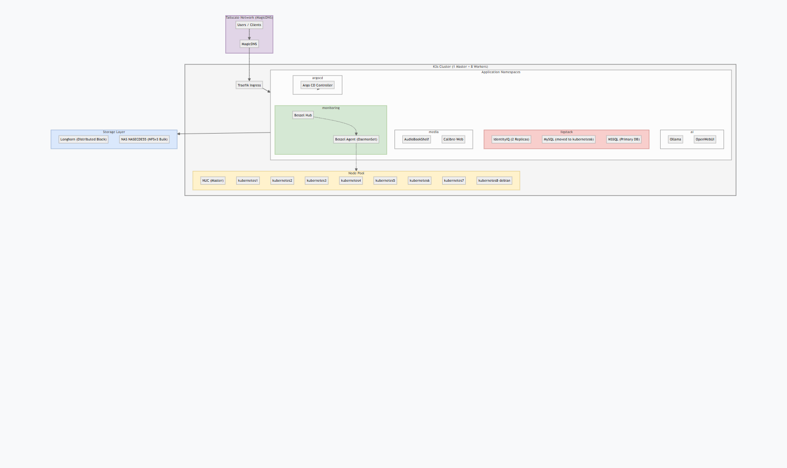

# 🧪 K3s Homelab Documentation

## 📅 Last Update Date

<2026-03-18>

---

## 🗺️ Architecture Diagram

> **Note:** The diagram above is rendered from [homelab_architecture.drawio](./homelab_architecture.drawio). You can open the source file in [diagrams.net](https://app.diagrams.net) to view or edit the full interactive version.

---

## 🖥️ System Overview

| Hostname     | Chassis        | OS Version           | Kernel                  | Architecture | Hardware Vendor        | Hardware Model                  | Firmware Version                        | Firmware Date      | Firmware Age     |
|--------------|----------------|----------------------|-------------------------|--------------|-----------------------|----------------------------------|-----------------------------------------|--------------------|------------------|
| NUC          | desktop 🖥️     | Ubuntu 24.04.2 LTS   | 6.14.0-37-generic       | x86-64       | Intel Corporation     | DCP847SKE                        | GKPPT10H.86A.0047.2013.1118.1714        | Mon 2013-11-18     | 11y 5m 3w        |
| kubernetes1  | desktop 🖥️     | Ubuntu 24.04.2 LTS   | 6.8.0-78-generic        | x86-64       | FUJITSU               | ESPRIMO Q520                      | V4.6.5.4 R1.47.0 for D3223-C1x          | Mon 2019-08-26     | 5y 8m 2w 1d      |
| kubernetes2  | desktop 🖥️     | Ubuntu 24.04.2 LTS   | 6.8.0-90-generic        | x86-64       | ITMediaConsult AG     | Pentino_H-Series A-4_M_H310-1     | 3202                                    | Sat 2021-07-10     | 3y 10m           |
| kubernetes3  | laptop 💻      | Ubuntu 24.04.2 LTS   | 6.8.0-78-generic        | x86-64       | GIGABYTE              | GB-BSi3-6100                      | F4                                      | Tue 2015-12-08     | 9y 5m 2d         |
| kubernetes4  |                | Ubuntu 24.04.2 LTS   | 6.8.0-78-generic        | x86-64       | Dell Inc.             | OptiPlex 9020                    | A25                                     | 05/30/2019         | 6y 1m 1w         |
| kubernetes5  | desktop 🖥️     | Ubuntu 24.04.2 LTS   | 6.11.0-26-generic       | x86-64       | Acer                  | Aspire XC-605                    | P11-A2                                  | 11/08/2013         | 12y 4m           |
| kubernetes6  | desktop 🖥️     | Ubuntu 24.04.2 LTS   | 6.8.0-90-generic        | x86-64       | FUJITSU               | ESPRIMO Q520                     | V4.6.5.4 R1.46.0 for D3223-C1x          | 08/29/2018         | 7y 6m            |

---

### 🆔 Machine & Boot IDs

| Hostname     | Machine ID                           | Boot ID                               |
|--------------|--------------------------------------|---------------------------------------|
| NUC          | 7f008044c9034b0bb5336558d14146e4     | 018d8e4b4f944b46acd7d2622238a25a      |
| kubernetes1  | 069b4db95ee44204b2b9711a5c8c758e     | f7e55003772c4a62947e986761071b49      |
| kubernetes2  | 7b40a6eec44842b68c4b0e6cece70b8     | 871de8b90262422d833376c12170509e      |
| kubernetes3  | fcf6d4cb3ab340a48e6567abb43f6334     | bf5ff8d6e62349648998170171fd8f09      |
| kubernetes4  | 8c1b18d2c52e4a1f941239f1abab8a06     | 4787e1fb-b008-494b-b9f6-ec9680be8097      |
| kubernetes5  | bf74ae462f274ce4aa6f87b4f21c94d3     | 804b0ba9-30b2-4f36-92a9-5dbf98b489a9  |
| kubernetes6  | 4a7ba178b74446bf8df14c82e51568df     | a3944f0e-6cb2-4695-ab0f-06f3bcf6dede  |

---

### 🖥️ CPU & Performance Overview

| Hostname     | CPU Model                                      | Cores | Threads | AVX | TPC | CPS |
|--------------|------------------------------------------------|------:|--------:|:---:|----:|----:|
| NUC          | Intel(R) Celeron(R) CPU 847E @ 1.10GHz         |     2 |       2 |  -  |   1 |   2 |
| kubernetes1  | Intel(R) Core(TM) i5-4590T CPU @ 2.00GHz       |     4 |       4 | ✅  |   1 |   4 |
| kubernetes2  | Intel(R) Core(TM) i3-8100 CPU @ 3.60GHz        |     4 |       4 | ✅  |   1 |   4 |
| kubernetes3  | Intel(R) Core(TM) i3-6100U CPU @ 2.30GHz       |     2 |       4 | ✅  |   2 |   2 |
| kubernetes4  | Intel(R) Core(TM) i5-4590S CPU @ 3.00GHz       |     4 |       4 | ✅  |   1 |   4 |
| kubernetes5  | Intel(R) Core(TM) i3-4130 CPU @ 3.40GHz        |     2 |       4 | ✅  |   2 |   2 |
| kubernetes6  | Intel(R) Core(TM) i3-4350T CPU @ 3.10GHz       |     2 |       4 | ✅  |   2 |   2 |

_TPC: Threads per Core | CPS: Cores per Socket | AVX: Accelerates LLM Inference_

### 🤖 AI/LLM Readiness & Hardware

| Hostname     | GPU / Graphics Controller                                      | AI Tier | Best Use Case Models |
|--------------|----------------------------------------------------------------|:-------:|----------------------|
| kubernetes1  | Intel 4th Gen Core Processor Integrated Graphics               | Tier 1  | 7B-8B (Llama3, Mistral) |
| kubernetes2  | Intel CoffeeLake-S GT2 [UHD Graphics 630]                      | Tier 1  | 7B-8B (Llama3, Mistral) |
| kubernetes3  | Intel Skylake GT2 [HD Graphics 520]                            | Tier 1  | 7B-8B (Llama3, Mistral) |
| kubernetes6  | Intel 4th Gen Core Processor Integrated Graphics               | Tier 1  | 7B-8B (Llama3, Mistral) |
| kubernetes4  | Intel 4th Gen Core Processor Integrated Graphics               | Tier 2  | 1B-3B (Gemma, Phi-3) |
| kubernetes5  | **NVIDIA GeForce GT 625 OEM** (Legacy)                         | Tier 2  | 1B-3B (Gemma, Phi-3) |
| NUC          | Intel Integrated Graphics                                      | -       | Master node only     |

### 🖥️ Memory Overview

| Hostname     | Total RAM | Used RAM | Free RAM | Buff/Cache | Available RAM | Total Swap | Used Swap | Free Swap |
|--------------|----------:|---------:|---------:|-----------:|--------------:|-----------:|----------:|----------:|
| NUC          |    7.7 Gi |   4.3 Gi |   3.0 Gi |     0.4 Gi |        3.4 Gi |     4.0 Gi |      0 B  |    4.0 Gi |
| kubernetes1  |     15 Gi |   0.7 Gi |    14 Gi |     0.3 Gi |         14 Gi |     4.0 Gi |      0 B  |    4.0 Gi |
| kubernetes2  |     14 Gi |   0.8 Gi |    13 Gi |     0.3 Gi |         13 Gi |     4.0 Gi |      0 B  |    4.0 Gi |
| kubernetes3  |     15 Gi |   0.8 Gi |    14 Gi |     0.3 Gi |         14 Gi |     4.0 Gi |      0 B  |    4.0 Gi |
| kubernetes4  |    7.7 Gi |   0.5 Gi |   7.0 Gi |     0.2 Gi |        7.0 Gi |     0 B    |      0 B  |    0 B    |
| kubernetes5  |    7.7 Gi |   0.5 Gi |   7.0 Gi |     0.2 Gi |        7.0 Gi |     4.0 Gi |      0 B  |    4.0 Gi |
| kubernetes6  |     15 Gi |   0.6 Gi |    14 Gi |     0.4 Gi |         14 Gi |     4.0 Gi |      0 B  |    4.0 Gi |

### 💾 Storage Inventory (100% NAS-Backed)

| Hostname     | Root Disk | Size     | Type | ROTA | Model                 | Usage (%) |
|--------------|-----------|----------|------|------|-----------------------|----------:|
| NUC          | sda       | 111.8G   | disk | 0    | KINGSTON SMS200S3120G | 19%       |
| kubernetes1  | sda       | 465.8G   | disk | 1    | ST500LM000-1EJ16      | 28%       |
| kubernetes2  | nvme0n1   | 931.5G   | disk | 0    | CT1000P3SSD8          | 12% (Freed) |
| kubernetes3  | sda       | 111.8G   | disk | 0    | KINGSTON SM2280S      | 23%       |
| kubernetes4  | sda       | 238.5G   | disk | 0    | SAMSUNG MZ7LN256      | 15% (Freed) |
| kubernetes5  | sda       | 931.5G   | disk | 1    | WDC WD10EZEX-21M      | 8%        |
| kubernetes6  | sda       | 465.8G   | disk | 1    | TOSHIBA MQ02ABF0      | 8%        |
| **NASECDE55**| **NAS**   | **423G** | nfs  | -    | **Primary Storage**   | **12%**   |

_ROTA: 0 = SSD, 1 = HDD | All app data moved to NAS._

## 📡 Network Configuration

| Node Role | Hostname | IP Address     | Interface | Link Speed | Notes         |
|-----------|----------|----------------|-----------|------------|---------------|
| master    |   **NUC**       |    192.168.0.21             |  eno1         | 1000 Mbps  |               |
| worker-1  |   **KUBERNETES1**       |      192.168.0.19           |    enp0s25        | 1000 Mbps  |               |
| worker-2  |   **KUBERNETES2**       |   192.168.0.20             |     enp2s0      | 1000 Mbps  |               |
| worker-3  |   **KUBERNETES3**       |    192.168.0.22            |     enp0s31f6      | 1000 Mbps  |               |
| worker-4  |   **KUBERNETES4**       |    192.168.0.23            |     eno1           | 1000 Mbps  |               |
| worker-5  |   **KUBERNETES5**       |    192.168.0.24            |     enp3s0         | 1000 Mbps  |               |
| worker-6  |   **KUBERNETES6**       |    192.168.0.25            |     enp0s25        | **100 Mbps** | Check cable   |
| **Storage**| **NASECDE55**   | **192.168.0.128**      | -             | 1000 Mbps  | MAC: 00:08:9b:ec:de:55 |

---

## 🚀 K3s Installation & Cluster Health

### 📊 Cluster Resource Utilization

| Node Name    | Role                 | CPU (cores) | CPU (%) | Memory (bytes) | Memory (%) | Status |
|--------------|----------------------|------------:|--------:|---------------:|-----------:|--------|
| nuc          | control-plane,master | 1971m       | 98%     | 4374 Mi        | 55%        | Ready  |
| kubernetes1  | worker               | 151m        | 3%      | 731 Mi         | 4%         | Ready  |
| kubernetes2  | worker               | 409m        | 10%     | 813 Mi         | 5%         | Ready  |
| kubernetes3  | worker               | 421m        | 10%     | 864 Mi         | 5%         | Ready  |
| kubernetes4  | worker               | 264m        | 6%      | 501 Mi         | 6%         | Ready  |
| kubernetes5  | worker               | 130m        | 3%      | 552 Mi         | 7%         | Ready  |
| kubernetes6  | worker               | 166m        | 4%      | 593 Mi         | 3%         | Ready  |

### 🚀 K3s Service Status (Synchronized)

| Hostname     | K3s Version                | Go Version   | Status   | Uptime       |
|--------------|----------------------------|-------------|----------|--------------|
| NUC          | **v1.34.5+k3s1**           | go1.23.6    | running  | Synchronized |
| kubernetes1  | **v1.34.5+k3s1**           | go1.23.6    | running  | Synchronized |
| kubernetes2  | **v1.34.5+k3s1**           | go1.23.6    | running  | Synchronized |
| kubernetes3  | **v1.34.5+k3s1**           | go1.23.6    | running  | Synchronized |
| kubernetes4  | **v1.34.5+k3s1**           | go1.23.6    | running  | Synchronized |
| kubernetes5  | **v1.34.5+k3s1**           | go1.23.6    | running  | Synchronized |
| kubernetes6  | **v1.34.5+k3s1**           | go1.23.6    | running  | Synchronized |

| Setting             | Value                         |
|---------------------|-------------------------------|
| Install Method      | curl                          |
| Cluster Token       | `<Stored securely>`           |
| Kubeconfig Path     | `~/.kube/config`              |
| SSH Auth            | **Passwordless (Ed25519)**    |
| **Default Storage** | **NFS NAS (nfs-nas)**         |

---

## 🛠️ Installed Add-ons / Tools

| Add-on         | Description           | Storage Class      | Controller         | Status |
|----------------|-----------------------|--------------------|--------------------|--------|
| Traefik        | Ingress Controller    | -                  | traefik-b64686b57  | ✅     |
| **NFS NAS**    | **Default Storage**   | **nfs-nas**        | **nfs-provisioner**| ✅     |
| Local Path     | Secondary Storage     | `local-path`       | local-path-prov    | ✅     |
| MetalLB        | LoadBalancer          | -                  | -                  | ✅     |
| Metrics Server | Resource Monitoring   | -                  | metrics-server     | ✅     |
| CloudNativePG  | PostgreSQL Operator   | -                  | cnpg-controller    | ✅     |

---

## 📦 Workloads & Access

### 🌐 Application Ingresses

| App Name     | Namespace | Ingress Host             | Endpoint Address (Service LoadBalancer IPs) |
|--------------|-----------|--------------------------|---------------------------------------------|
| OpenWebUI    | ai        | `openwebui.local`        | 192.168.0.19, .20, .21, .22, .23, .24, .25  |
| IdentityIQ   | default   | `identityiq.example.com` | 192.168.0.19, .20, .21, .22, .23, .24, .25  |
| phpLDAPadmin | default   | `phpldapadmin.example.com`| 192.168.0.19, .20, .21, .22, .23, .24, .25 |

### 📦 Running Workloads (Namespace View)

| Namespace     | App Name         | Pod Status        | Age   | Notes                       |
|---------------|------------------|-------------------|-------|-----------------------------|
| **ai**        | ollama           | 1/1 Running       | 1h    | **Migrated to NAS** (`ollama-nas-pvc`) |
| **ai**        | openwebui        | 1/1 Running       | 1h    | **Migrated to NAS** (`webui-nas-pvc`) |
| **argocd**    | server/redis/dex | 1/1 Running       | 79d   | Full ArgoCD Stack active    |
| **default**   | identityiq (iiq) | **0/1 ErrImagePull**| 210d| Registry at 192.168.0.236 is OFFLINE |
| **default**   | mysql (db)       | 1/1 Running       | 1h    | **Migrated to NAS** (`mysql-nas-pvc`) |
| **default**   | mssql (db)       | 1/1 Running       | 15m   | **Migrated to NAS** (`mssql-nas-pvc`) |
| **default**   | activemq/ldap    | 1/1 Running       | 15m   | **Migrated to NAS** (`ldap-nas-pvc`) |
| **default**   | mail (MailHog)   | 1/1 Running       | 79d   |                             |
| **default**   | phpldapadmin     | 2/2 Running       | 210d  | High availability setup     |
| **default**   | ssh-deployment   | 1/1 Running       | 79d   |                             |

---

## 🔐 Authentication & Access

| Component       | Configuration                                                                 |
|-----------------|-------------------------------------------------------------------------------|
| Kubeconfig      | Present (`cat ~/.kube/config` shows cluster, user, and certs)                 |
| **SSH Access**  | **Passwordless (Ed25519)**. Trusted keys provisioned across all nodes and NAS.|
| SSH Fingerprint | `SHA256:URooKHsJxxu8xuA5rrpzWRuXZacp93gkKZO9yISRJVg` (Local Host)             |
| Automation      | PowerShell functions `Test-KubernetesNodes` and `Stop-K3sHomelab` enabled.    |
| RBAC Settings   | Roles and rolebindings exist in various namespaces (e.g., `argocd`, `kube-system`) |
| Users/Groups    | Single user (`default`) via kubeconfig; OIDC not configured                   |
| API Access      | Port `6443`, secured with certificates (see `server:` and `certificate-authority-data` in kubeconfig) |

### 🛠️ SSH Trust Matrix
All nodes below trust the local `id_ed25519` public key:
*   **Master:** NUC (`192.168.0.21`)
*   **Workers:** kubernetes1 through kubernetes6
*   **Storage:** NASECDE55 NAS (`192.168.0.128`)

---

## 📊 Monitoring & Logging

| Tool         | Status | Notes                   |
|--------------|--------|-------------------------|
| Grafana      | ❌     | Dashboard Enabled       |
| Prometheus   | ❌    | Targets OK              |
| Loki         | ⬜      | Planned                 |
| Fluent Bit   | ⬜      | TBD                     |

---

## 🔁 Backup & Recovery (Triple Protection System)

| Tool      | Setup Status | Command/Notes                        |
|-----------|--------------|--------------------------------------|
| **Manual**| ✅ Active    | `sudo /usr/local/bin/k3s-backup-to-nas.sh` |
| **Cron**  | ✅ Scheduled | Daily at 2:00 AM (to NAS)            |
| **Pre-Shut**| ✅ Enabled | `k3s-nas-backup.service` (Systemd)   |
| **Recovery**| ✅ Ready   | `sudo /usr/local/bin/k3s-recovery.sh` |

---

## ⚠️ Issues & Troubleshooting Notes

- [ ] Node `kubernetes6`: Link speed at **100 Mbps**. (Action: Check cable/port)
- [ ] **default/iiq**: Pod in `ErrImagePull`. (Root Cause: Registry at .236 is unreachable)
- [ ] Multiple nodes: `systemd-networkd-wait-online.service` failing. (Minor)

---

## 📚 Useful Commands

\`\`\`bash
# List nodes
kubectl get nodes

# Get all pods in all namespaces
kubectl get pods -A

# View k3s logs
journalctl -u k3s -f

# Helm list
helm list -A
\`\`\`
